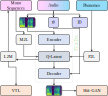

[//]: #      

[//]: #        <a href="" class="btn2">• GitHub •</a>
[//]: #       <a href="" class="btn2">• Paper •</a></li>
[//]: #       <a href="" class="btn2">• Examples •</a></li>
[//]: #      

<h2><b>Self-Supervised Solution to the Control Problem of Articulatory Synthesis</b></h2>

 Interspeech 2023, Authors will be revealed upon paper acceptance 

 Code, models and the paper itself will be published upon paper acceptance 

 

<h3>Abstract</h3>

 
Given an articulatory-to-acoustic forward model, it is a priori unknown how its motor control must be operated to achieve a desired acoustic result. This control problem is a fundamental issue of articulatory speech synthesis and the cradle of acoustic-to-articulatory inversion, a discipline which attempts to address the issue by the means of various methods. This work presents an end-to-end solution to the articulatory control problem, in which synthetic motor trajectories of Monte-Carlo-generated artificial speech are linked to input modalities (such as natural speech recordings or phoneme sequence input) via speaker-independent latent representations of a vector-quantized variational autoencoder. The proposed method is self-supervised and thus, in principle, synthesizer and speaker model independent.

 

<h2>TensorTract Functionality</h2>

 
TensorTract is a compound model of multiple deep neural networks. It is capable to perform a number of tasks including acoustic-to-articulatory inversion (AAI), phoneme-to-articulatory conversion (P2A) and articulatory-to-acoustic neural speech synthesis. In case of AAI and P2A, TensorTract provides articulatory trajectories that are compatible with the state-of-the-art articulatory speech synthesizer VocalTractLab (VTL).

 

 

The centerpiece of TensorTract is a vector-quantized variational autoencoder (VQ-VAE), which maps log-melspectrograms via an TCN-based encoder to a speaker independent quantized latent representation and then back to log-mel features via a speaker and pitch conditioned decoder. The VQ-VAE is trained on both natural and synthetic speech, whereby the latter is generated randomly using VTL. In subsequent training processes, the synthetic articulatory trajectories are mapped to the quantized latent via a forward model M2L (motor-to-latent) and an inverse model L2M (latent-to-motor). This creates a link between natural speech data and synthetic articulatory trajectories. Further, phoneme annotations of the natural speech are mapped to the latent via another forward model P2L (phoneme-to-latent). This effectively enables the control of VTL via natural speech and/or phoneme sequence input.

 

<h2>Phoneme-to-Articulatory Conversion</h2>

<b>Tested on natural phoneme sequences</b> (KIEL data set, Berlin sentences).

<table border="1">
<tr><td>Model</td><td colspan="12"> Utterances </td></tr>
<tr>
  <td></td>
 
  <td>k02be001</td>
  <td>k02be002</td>
  <td>k02be003</td>
  <td>k02be004</td>
  <td>k02be005</td>
  <td>k02be006</td>
  <td>k02be007</td>
  <td>k02be008</td>
  <td>k02be009</td>
  <td>k02be010</td>

  <td>k61be001</td>
  <td>k61be002</td>
  <td>k61be003</td>
  <td>k61be004</td>
  <td>k61be005</td>
  <td>k61be006</td>
  <td>k61be007</td>
  <td>k61be008</td>
  <td>k61be009</td>
  <td>k61be010</td>
</tr>

<tr><td>Reference</td>
  <td><audio controls style="width: 110px;" src="audio_examples/nat/k02be001.wav"></audio></td>
  <td><audio controls style="width: 110px;" src="audio_examples/nat/k02be002.wav"></audio></td>
  <td><audio controls style="width: 110px;" src="audio_examples/nat/k02be003.wav"></audio></td>
  <td><audio controls style="width: 110px;" src="audio_examples/nat/k02be004.wav"></audio></td>
  <td><audio controls style="width: 110px;" src="audio_examples/nat/k02be005.wav"></audio></td>
  <td><audio controls style="width: 110px;" src="audio_examples/nat/k02be006.wav"></audio></td>
  <td><audio controls style="width: 110px;" src="audio_examples/nat/k02be007.wav"></audio></td>
  <td><audio controls style="width: 110px;" src="audio_examples/nat/k02be008.wav"></audio></td>
  <td><audio controls style="width: 110px;" src="audio_examples/nat/k02be009.wav"></audio></td>
  <td><audio controls style="width: 110px;" src="audio_examples/nat/k02be010.wav"></audio></td>
  <td><audio controls style="width: 110px;" src="audio_examples/nat/k61be001.wav"></audio></td>
  <td><audio controls style="width: 110px;" src="audio_examples/nat/k61be002.wav"></audio></td>
  <td><audio controls style="width: 110px;" src="audio_examples/nat/k61be003.wav"></audio></td>
  <td><audio controls style="width: 110px;" src="audio_examples/nat/k61be004.wav"></audio></td>
  <td><audio controls style="width: 110px;" src="audio_examples/nat/k61be005.wav"></audio></td>
  <td><audio controls style="width: 110px;" src="audio_examples/nat/k61be006.wav"></audio></td>
  <td><audio controls style="width: 110px;" src="audio_examples/nat/k61be007.wav"></audio></td>
  <td><audio controls style="width: 110px;" src="audio_examples/nat/k61be008.wav"></audio></td>
  <td><audio controls style="width: 110px;" src="audio_examples/nat/k61be009.wav"></audio></td>
  <td><audio controls style="width: 110px;" src="audio_examples/nat/k61be010.wav"></audio></td>
</tr>
<tr><td>P2L+V</td>
  <td><audio controls style="width: 110px;" src="audio_examples/p2l/KIELk02_k02be001.wav"></audio></td>
  <td><audio controls style="width: 110px;" src="audio_examples/p2l/KIELk02_k02be002.wav"></audio></td>
  <td><audio controls style="width: 110px;" src="audio_examples/p2l/KIELk02_k02be003.wav"></audio></td>
  <td><audio controls style="width: 110px;" src="audio_examples/p2l/KIELk02_k02be004.wav"></audio></td>
  <td><audio controls style="width: 110px;" src="audio_examples/p2l/KIELk02_k02be005.wav"></audio></td>
  <td><audio controls style="width: 110px;" src="audio_examples/p2l/KIELk02_k02be006.wav"></audio></td>
  <td><audio controls style="width: 110px;" src="audio_examples/p2l/KIELk02_k02be007.wav"></audio></td>
  <td><audio controls style="width: 110px;" src="audio_examples/p2l/KIELk02_k02be008.wav"></audio></td>
  <td><audio controls style="width: 110px;" src="audio_examples/p2l/KIELk02_k02be009.wav"></audio></td>
  <td><audio controls style="width: 110px;" src="audio_examples/p2l/KIELk02_k02be010.wav"></audio></td>
  <td><audio controls style="width: 110px;" src="audio_examples/p2l/KIELk61_k61be001.wav"></audio></td>
  <td><audio controls style="width: 110px;" src="audio_examples/p2l/KIELk61_k61be002.wav"></audio></td>
  <td><audio controls style="width: 110px;" src="audio_examples/p2l/KIELk61_k61be003.wav"></audio></td>
  <td><audio controls style="width: 110px;" src="audio_examples/p2l/KIELk61_k61be004.wav"></audio></td>
  <td><audio controls style="width: 110px;" src="audio_examples/p2l/KIELk61_k61be005.wav"></audio></td>
  <td><audio controls style="width: 110px;" src="audio_examples/p2l/KIELk61_k61be006.wav"></audio></td>
  <td><audio controls style="width: 110px;" src="audio_examples/p2l/KIELk61_k61be007.wav"></audio></td>
  <td><audio controls style="width: 110px;" src="audio_examples/p2l/KIELk61_k61be008.wav"></audio></td>
  <td><audio controls style="width: 110px;" src="audio_examples/p2l/KIELk61_k61be009.wav"></audio></td>
  <td><audio controls style="width: 110px;" src="audio_examples/p2l/KIELk61_k61be010.wav"></audio></td>
</tr>
<tr><td>VTL (Rule-based)</td>
  <td><audio controls style="width: 110px;" src="audio_examples/vtl/k02_k02be001.wav"></audio></td>
  <td><audio controls style="width: 110px;" src="audio_examples/vtl/k02_k02be002.wav"></audio></td>
  <td><audio controls style="width: 110px;" src="audio_examples/vtl/k02_k02be003.wav"></audio></td>
  <td><audio controls style="width: 110px;" src="audio_examples/vtl/k02_k02be004.wav"></audio></td>
  <td><audio controls style="width: 110px;" src="audio_examples/vtl/k02_k02be005.wav"></audio></td>
  <td><audio controls style="width: 110px;" src="audio_examples/vtl/k02_k02be006.wav"></audio></td>
  <td><audio controls style="width: 110px;" src="audio_examples/vtl/k02_k02be007.wav"></audio></td>
  <td><audio controls style="width: 110px;" src="audio_examples/vtl/k02_k02be008.wav"></audio></td>
  <td><audio controls style="width: 110px;" src="audio_examples/vtl/k02_k02be009.wav"></audio></td>
  <td><audio controls style="width: 110px;" src="audio_examples/vtl/k02_k02be010.wav"></audio></td>
  <td><audio controls style="width: 110px;" src="audio_examples/vtl/k61_k61be001.wav"></audio></td>
  <td><audio controls style="width: 110px;" src="audio_examples/vtl/k61_k61be002.wav"></audio></td>
  <td><audio controls style="width: 110px;" src="audio_examples/vtl/k61_k61be003.wav"></audio></td>
  <td><audio controls style="width: 110px;" src="audio_examples/vtl/k61_k61be004.wav"></audio></td>
  <td><audio controls style="width: 110px;" src="audio_examples/vtl/k61_k61be005.wav"></audio></td>
  <td><audio controls style="width: 110px;" src="audio_examples/vtl/k61_k61be006.wav"></audio></td>
  <td><audio controls style="width: 110px;" src="audio_examples/vtl/k61_k61be007.wav"></audio></td>
  <td><audio controls style="width: 110px;" src="audio_examples/vtl/k61_k61be008.wav"></audio></td>
  <td><audio controls style="width: 110px;" src="audio_examples/vtl/k61_k61be009.wav"></audio></td>
  <td><audio controls style="width: 110px;" src="audio_examples/vtl/k61_k61be010.wav"></audio></td>
</tr>
<tr><td>M2L+H</td>
  <td><audio controls style="width: 110px;" src="audio_examples/m2l/k02_k02be001_generated_e2e.wav"></audio></td>
  <td><audio controls style="width: 110px;" src="audio_examples/m2l/k02_k02be002_generated_e2e.wav"></audio></td>
  <td><audio controls style="width: 110px;" src="audio_examples/m2l/k02_k02be003_generated_e2e.wav"></audio></td>
  <td><audio controls style="width: 110px;" src="audio_examples/m2l/k02_k02be004_generated_e2e.wav"></audio></td>
  <td><audio controls style="width: 110px;" src="audio_examples/m2l/k02_k02be005_generated_e2e.wav"></audio></td>
  <td><audio controls style="width: 110px;" src="audio_examples/m2l/k02_k02be006_generated_e2e.wav"></audio></td>
  <td><audio controls style="width: 110px;" src="audio_examples/m2l/k02_k02be007_generated_e2e.wav"></audio></td>
  <td><audio controls style="width: 110px;" src="audio_examples/m2l/k02_k02be008_generated_e2e.wav"></audio></td>
  <td><audio controls style="width: 110px;" src="audio_examples/m2l/k02_k02be009_generated_e2e.wav"></audio></td>
  <td><audio controls style="width: 110px;" src="audio_examples/m2l/k02_k02be010_generated_e2e.wav"></audio></td>
  <td><audio controls style="width: 110px;" src="audio_examples/m2l/k61_k61be001_generated_e2e.wav"></audio></td>
  <td><audio controls style="width: 110px;" src="audio_examples/m2l/k61_k61be002_generated_e2e.wav"></audio></td>
  <td><audio controls style="width: 110px;" src="audio_examples/m2l/k61_k61be003_generated_e2e.wav"></audio></td>
  <td><audio controls style="width: 110px;" src="audio_examples/m2l/k61_k61be004_generated_e2e.wav"></audio></td>
  <td><audio controls style="width: 110px;" src="audio_examples/m2l/k61_k61be005_generated_e2e.wav"></audio></td>
  <td><audio controls style="width: 110px;" src="audio_examples/m2l/k61_k61be006_generated_e2e.wav"></audio></td>
  <td><audio controls style="width: 110px;" src="audio_examples/m2l/k61_k61be007_generated_e2e.wav"></audio></td>
  <td><audio controls style="width: 110px;" src="audio_examples/m2l/k61_k61be008_generated_e2e.wav"></audio></td>
  <td><audio controls style="width: 110px;" src="audio_examples/m2l/k61_k61be009_generated_e2e.wav"></audio></td>
  <td><audio controls style="width: 110px;" src="audio_examples/m2l/k61_k61be010_generated_e2e.wav"></audio></td>
</tr>
<tr><td>M2L+H (V-ID)</td>
  <td><audio controls style="width: 110px;" src="audio_examples/m2l_mc_id/k02_k02be001_generated_e2e.wav"></audio></td>
  <td><audio controls style="width: 110px;" src="audio_examples/m2l_mc_id/k02_k02be002_generated_e2e.wav"></audio></td>
  <td><audio controls style="width: 110px;" src="audio_examples/m2l_mc_id/k02_k02be003_generated_e2e.wav"></audio></td>
  <td><audio controls style="width: 110px;" src="audio_examples/m2l_mc_id/k02_k02be004_generated_e2e.wav"></audio></td>
  <td><audio controls style="width: 110px;" src="audio_examples/m2l_mc_id/k02_k02be005_generated_e2e.wav"></audio></td>
  <td><audio controls style="width: 110px;" src="audio_examples/m2l_mc_id/k02_k02be006_generated_e2e.wav"></audio></td>
  <td><audio controls style="width: 110px;" src="audio_examples/m2l_mc_id/k02_k02be007_generated_e2e.wav"></audio></td>
  <td><audio controls style="width: 110px;" src="audio_examples/m2l_mc_id/k02_k02be008_generated_e2e.wav"></audio></td>
  <td><audio controls style="width: 110px;" src="audio_examples/m2l_mc_id/k02_k02be009_generated_e2e.wav"></audio></td>
  <td><audio controls style="width: 110px;" src="audio_examples/m2l_mc_id/k02_k02be010_generated_e2e.wav"></audio></td>
  <td><audio controls style="width: 110px;" src="audio_examples/m2l_mc_id/k61_k61be001_generated_e2e.wav"></audio></td>
  <td><audio controls style="width: 110px;" src="audio_examples/m2l_mc_id/k61_k61be002_generated_e2e.wav"></audio></td>
  <td><audio controls style="width: 110px;" src="audio_examples/m2l_mc_id/k61_k61be003_generated_e2e.wav"></audio></td>
  <td><audio controls style="width: 110px;" src="audio_examples/m2l_mc_id/k61_k61be004_generated_e2e.wav"></audio></td>
  <td><audio controls style="width: 110px;" src="audio_examples/m2l_mc_id/k61_k61be005_generated_e2e.wav"></audio></td>
  <td><audio controls style="width: 110px;" src="audio_examples/m2l_mc_id/k61_k61be006_generated_e2e.wav"></audio></td>
  <td><audio controls style="width: 110px;" src="audio_examples/m2l_mc_id/k61_k61be007_generated_e2e.wav"></audio></td>
  <td><audio controls style="width: 110px;" src="audio_examples/m2l_mc_id/k61_k61be008_generated_e2e.wav"></audio></td>
  <td><audio controls style="width: 110px;" src="audio_examples/m2l_mc_id/k61_k61be009_generated_e2e.wav"></audio></td>
  <td><audio controls style="width: 110px;" src="audio_examples/m2l_mc_id/k61_k61be010_generated_e2e.wav"></audio></td>
</tr>

</table>

 

<b>Zero-shot phoneme-to-speech</b> (unseen speakers, unseen utterances from KIEL data set, Siemens sentences).

<table border="1">
<tr><td>Model</td><td colspan="12"> Utterances </td></tr>
<tr>
  <td></td>
 
  <td>dlmsi038</td>
  <td>dlmsi063</td>
  <td>dlmsi064</td>
  <td>dlmsi072</td>
  <td>dlmsi092</td>

</tr>

<tr><td>Reference</td>
  <td><audio controls style="width: 110px;" src="audio_examples/nat/dlmsi038.wav"></audio></td>
  <td><audio controls style="width: 110px;" src="audio_examples/nat/dlmsi063.wav"></audio></td>
  <td><audio controls style="width: 110px;" src="audio_examples/nat/dlmsi064.wav"></audio></td>
  <td><audio controls style="width: 110px;" src="audio_examples/nat/dlmsi072.wav"></audio></td>
  <td><audio controls style="width: 110px;" src="audio_examples/nat/dlmsi092.wav"></audio></td> 
</tr>
<tr><td>P2L+V</td>
  <td><audio controls style="width: 110px;" src="audio_examples/p2l_zero/KIELdlm_dlmsi038.wav"></audio></td>
  <td><audio controls style="width: 110px;" src="audio_examples/p2l_zero/KIELdlm_dlmsi063.wav"></audio></td>
  <td><audio controls style="width: 110px;" src="audio_examples/p2l_zero/KIELdlm_dlmsi064.wav"></audio></td>
  <td><audio controls style="width: 110px;" src="audio_examples/p2l_zero/KIELdlm_dlmsi072.wav"></audio></td>
  <td><audio controls style="width: 110px;" src="audio_examples/p2l_zero/KIELdlm_dlmsi092.wav"></audio></td>
</tr>
<tr><td>VTL (Rule-based)</td>
  <td><audio controls style="width: 110px;" src="audio_examples/vtl/dlm_dlmsi038.wav"></audio></td>
  <td><audio controls style="width: 110px;" src="audio_examples/vtl/dlm_dlmsi063.wav"></audio></td>
  <td><audio controls style="width: 110px;" src="audio_examples/vtl/dlm_dlmsi064.wav"></audio></td>
  <td><audio controls style="width: 110px;" src="audio_examples/vtl/dlm_dlmsi072.wav"></audio></td>
  <td><audio controls style="width: 110px;" src="audio_examples/vtl/dlm_dlmsi092.wav"></audio></td>
</tr>

</table>

 

<h2>Acoustic-to-Articulatory Inversion</h2>

<b>Tested on natural audio samples</b> (KIEL data set, Berlin sentences).

<table border="1">
<tr><td>Model</td><td colspan="12">Utterances </td></tr>
<tr>
  <td></td>
 
  <td>k61be011</td>
  <td>k61be018</td>
  <td>k61be023</td>
  <td>k61be030</td>
  <td>k61be037</td>
  <td>k61be061</td>
  <td>k62be005</td>
  <td>k62be024</td>
  <td>k62be086</td>
  <td>k62be095</td>

  <td>k65be002</td>
  <td>k65be013</td>
  <td>k65be017</td>
  <td>k65be075</td>
  <td>k65be077</td>
  <td>k66be008</td>
  <td>k66be041</td>
  <td>k66be060</td>
  <td>k66be062</td>
  <td>k66be063</td>
</tr>

<tr><td>Reference</td>
  <td><audio controls style="width: 110px;" src="audio_examples/nat/k61be011.wav"></audio></td>
  <td><audio controls style="width: 110px;" src="audio_examples/nat/k61be018.wav"></audio></td>
  <td><audio controls style="width: 110px;" src="audio_examples/nat/k61be023.wav"></audio></td>
  <td><audio controls style="width: 110px;" src="audio_examples/nat/k61be030.wav"></audio></td>
  <td><audio controls style="width: 110px;" src="audio_examples/nat/k61be037.wav"></audio></td>
  <td><audio controls style="width: 110px;" src="audio_examples/nat/k61be061.wav"></audio></td>
  <td><audio controls style="width: 110px;" src="audio_examples/nat/k62be005.wav"></audio></td>
  <td><audio controls style="width: 110px;" src="audio_examples/nat/k62be024.wav"></audio></td>
  <td><audio controls style="width: 110px;" src="audio_examples/nat/k62be086.wav"></audio></td>
  <td><audio controls style="width: 110px;" src="audio_examples/nat/k62be095.wav"></audio></td>
  <td><audio controls style="width: 110px;" src="audio_examples/nat/k65be002.wav"></audio></td>
  <td><audio controls style="width: 110px;" src="audio_examples/nat/k65be013.wav"></audio></td>
  <td><audio controls style="width: 110px;" src="audio_examples/nat/k65be017.wav"></audio></td>
  <td><audio controls style="width: 110px;" src="audio_examples/nat/k65be075.wav"></audio></td>
  <td><audio controls style="width: 110px;" src="audio_examples/nat/k65be077.wav"></audio></td>
  <td><audio controls style="width: 110px;" src="audio_examples/nat/k66be008.wav"></audio></td>
  <td><audio controls style="width: 110px;" src="audio_examples/nat/k66be041.wav"></audio></td>
  <td><audio controls style="width: 110px;" src="audio_examples/nat/k66be060.wav"></audio></td>
  <td><audio controls style="width: 110px;" src="audio_examples/nat/k66be062.wav"></audio></td>
  <td><audio controls style="width: 110px;" src="audio_examples/nat/k66be063.wav"></audio></td>
</tr>
<tr><td>L2M+V</td>
  <td><audio controls style="width: 110px;" src="audio_examples/l2m/k61be011.wav"></audio></td>
  <td><audio controls style="width: 110px;" src="audio_examples/l2m/k61be018.wav"></audio></td>
  <td><audio controls style="width: 110px;" src="audio_examples/l2m/k61be023.wav"></audio></td>
  <td><audio controls style="width: 110px;" src="audio_examples/l2m/k61be030.wav"></audio></td>
  <td><audio controls style="width: 110px;" src="audio_examples/l2m/k61be037.wav"></audio></td>
  <td><audio controls style="width: 110px;" src="audio_examples/l2m/k61be061.wav"></audio></td>
  <td><audio controls style="width: 110px;" src="audio_examples/l2m/k62be005.wav"></audio></td>
  <td><audio controls style="width: 110px;" src="audio_examples/l2m/k62be024.wav"></audio></td>
  <td><audio controls style="width: 110px;" src="audio_examples/l2m/k62be086.wav"></audio></td>
  <td><audio controls style="width: 110px;" src="audio_examples/l2m/k62be095.wav"></audio></td>
  <td><audio controls style="width: 110px;" src="audio_examples/l2m/k65be002.wav"></audio></td>
  <td><audio controls style="width: 110px;" src="audio_examples/l2m/k65be013.wav"></audio></td>
  <td><audio controls style="width: 110px;" src="audio_examples/l2m/k65be017.wav"></audio></td>
  <td><audio controls style="width: 110px;" src="audio_examples/l2m/k65be075.wav"></audio></td>
  <td><audio controls style="width: 110px;" src="audio_examples/l2m/k65be077.wav"></audio></td>
  <td><audio controls style="width: 110px;" src="audio_examples/l2m/k66be008.wav"></audio></td>
  <td><audio controls style="width: 110px;" src="audio_examples/l2m/k66be041.wav"></audio></td>
  <td><audio controls style="width: 110px;" src="audio_examples/l2m/k66be060.wav"></audio></td>
  <td><audio controls style="width: 110px;" src="audio_examples/l2m/k66be062.wav"></audio></td>
  <td><audio controls style="width: 110px;" src="audio_examples/l2m/k66be063.wav"></audio></td>
</tr>
<tr><td>L2M+H</td>
  <td><audio controls style="width: 110px;" src="audio_examples/l2m_m2l/KIELk61_k61be011_generated_e2e.wav"></audio></td>
  <td><audio controls style="width: 110px;" src="audio_examples/l2m_m2l/KIELk61_k61be018_generated_e2e.wav"></audio></td>
  <td><audio controls style="width: 110px;" src="audio_examples/l2m_m2l/KIELk61_k61be023_generated_e2e.wav"></audio></td>
  <td><audio controls style="width: 110px;" src="audio_examples/l2m_m2l/KIELk61_k61be030_generated_e2e.wav"></audio></td>
  <td><audio controls style="width: 110px;" src="audio_examples/l2m_m2l/KIELk61_k61be037_generated_e2e.wav"></audio></td>
  <td><audio controls style="width: 110px;" src="audio_examples/l2m_m2l/KIELk61_k61be061_generated_e2e.wav"></audio></td>
  <td><audio controls style="width: 110px;" src="audio_examples/l2m_m2l/KIELk62_k62be005_generated_e2e.wav"></audio></td>
  <td><audio controls style="width: 110px;" src="audio_examples/l2m_m2l/KIELk62_k62be024_generated_e2e.wav"></audio></td>
  <td><audio controls style="width: 110px;" src="audio_examples/l2m_m2l/KIELk62_k62be086_generated_e2e.wav"></audio></td>
  <td><audio controls style="width: 110px;" src="audio_examples/l2m_m2l/KIELk62_k62be095_generated_e2e.wav"></audio></td>
  <td><audio controls style="width: 110px;" src="audio_examples/l2m_m2l/KIELk65_k65be002_generated_e2e.wav"></audio></td>
  <td><audio controls style="width: 110px;" src="audio_examples/l2m_m2l/KIELk65_k65be013_generated_e2e.wav"></audio></td>
  <td><audio controls style="width: 110px;" src="audio_examples/l2m_m2l/KIELk65_k65be017_generated_e2e.wav"></audio></td>
  <td><audio controls style="width: 110px;" src="audio_examples/l2m_m2l/KIELk65_k65be075_generated_e2e.wav"></audio></td>
  <td><audio controls style="width: 110px;" src="audio_examples/l2m_m2l/KIELk65_k65be077_generated_e2e.wav"></audio></td>
  <td><audio controls style="width: 110px;" src="audio_examples/l2m_m2l/KIELk66_k66be008_generated_e2e.wav"></audio></td>
  <td><audio controls style="width: 110px;" src="audio_examples/l2m_m2l/KIELk66_k66be041_generated_e2e.wav"></audio></td>
  <td><audio controls style="width: 110px;" src="audio_examples/l2m_m2l/KIELk66_k66be060_generated_e2e.wav"></audio></td>
  <td><audio controls style="width: 110px;" src="audio_examples/l2m_m2l/KIELk66_k66be062_generated_e2e.wav"></audio></td>
  <td><audio controls style="width: 110px;" src="audio_examples/l2m_m2l/KIELk66_k66be063_generated_e2e.wav"></audio></td>
</tr>
<tr><td>L2M+H (V-ID)</td>
  <td><audio controls style="width: 110px;" src="audio_examples/l2m_m2l_mc_id/KIELk61_k61be011_generated_e2e.wav"></audio></td>
  <td><audio controls style="width: 110px;" src="audio_examples/l2m_m2l_mc_id/KIELk61_k61be018_generated_e2e.wav"></audio></td>
  <td><audio controls style="width: 110px;" src="audio_examples/l2m_m2l_mc_id/KIELk61_k61be023_generated_e2e.wav"></audio></td>
  <td><audio controls style="width: 110px;" src="audio_examples/l2m_m2l_mc_id/KIELk61_k61be030_generated_e2e.wav"></audio></td>
  <td><audio controls style="width: 110px;" src="audio_examples/l2m_m2l_mc_id/KIELk61_k61be037_generated_e2e.wav"></audio></td>
  <td><audio controls style="width: 110px;" src="audio_examples/l2m_m2l_mc_id/KIELk61_k61be061_generated_e2e.wav"></audio></td>
  <td><audio controls style="width: 110px;" src="audio_examples/l2m_m2l_mc_id/KIELk62_k62be005_generated_e2e.wav"></audio></td>
  <td><audio controls style="width: 110px;" src="audio_examples/l2m_m2l_mc_id/KIELk62_k62be024_generated_e2e.wav"></audio></td>
  <td><audio controls style="width: 110px;" src="audio_examples/l2m_m2l_mc_id/KIELk62_k62be086_generated_e2e.wav"></audio></td>
  <td><audio controls style="width: 110px;" src="audio_examples/l2m_m2l_mc_id/KIELk62_k62be095_generated_e2e.wav"></audio></td>
  <td><audio controls style="width: 110px;" src="audio_examples/l2m_m2l_mc_id/KIELk65_k65be002_generated_e2e.wav"></audio></td>
  <td><audio controls style="width: 110px;" src="audio_examples/l2m_m2l_mc_id/KIELk65_k65be013_generated_e2e.wav"></audio></td>
  <td><audio controls style="width: 110px;" src="audio_examples/l2m_m2l_mc_id/KIELk65_k65be017_generated_e2e.wav"></audio></td>
  <td><audio controls style="width: 110px;" src="audio_examples/l2m_m2l_mc_id/KIELk65_k65be075_generated_e2e.wav"></audio></td>
  <td><audio controls style="width: 110px;" src="audio_examples/l2m_m2l_mc_id/KIELk65_k65be077_generated_e2e.wav"></audio></td>
  <td><audio controls style="width: 110px;" src="audio_examples/l2m_m2l_mc_id/KIELk66_k66be008_generated_e2e.wav"></audio></td>
  <td><audio controls style="width: 110px;" src="audio_examples/l2m_m2l_mc_id/KIELk66_k66be041_generated_e2e.wav"></audio></td>
  <td><audio controls style="width: 110px;" src="audio_examples/l2m_m2l_mc_id/KIELk66_k66be060_generated_e2e.wav"></audio></td>
  <td><audio controls style="width: 110px;" src="audio_examples/l2m_m2l_mc_id/KIELk66_k66be062_generated_e2e.wav"></audio></td>
  <td><audio controls style="width: 110px;" src="audio_examples/l2m_m2l_mc_id/KIELk66_k66be063_generated_e2e.wav"></audio></td>
</tr>
<tr><td>VQV+H</td>
  <td><audio controls style="width: 110px;" src="audio_examples/vqvae/KIELk61_k61be011_generated_e2e.wav"></audio></td>
  <td><audio controls style="width: 110px;" src="audio_examples/vqvae/KIELk61_k61be018_generated_e2e.wav"></audio></td>
  <td><audio controls style="width: 110px;" src="audio_examples/vqvae/KIELk61_k61be023_generated_e2e.wav"></audio></td>
  <td><audio controls style="width: 110px;" src="audio_examples/vqvae/KIELk61_k61be030_generated_e2e.wav"></audio></td>
  <td><audio controls style="width: 110px;" src="audio_examples/vqvae/KIELk61_k61be037_generated_e2e.wav"></audio></td>
  <td><audio controls style="width: 110px;" src="audio_examples/vqvae/KIELk61_k61be061_generated_e2e.wav"></audio></td>
  <td><audio controls style="width: 110px;" src="audio_examples/vqvae/KIELk62_k62be005_generated_e2e.wav"></audio></td>
  <td><audio controls style="width: 110px;" src="audio_examples/vqvae/KIELk62_k62be024_generated_e2e.wav"></audio></td>
  <td><audio controls style="width: 110px;" src="audio_examples/vqvae/KIELk62_k62be086_generated_e2e.wav"></audio></td>
  <td><audio controls style="width: 110px;" src="audio_examples/vqvae/KIELk62_k62be095_generated_e2e.wav"></audio></td>
  <td><audio controls style="width: 110px;" src="audio_examples/vqvae/KIELk65_k65be002_generated_e2e.wav"></audio></td>
  <td><audio controls style="width: 110px;" src="audio_examples/vqvae/KIELk65_k65be013_generated_e2e.wav"></audio></td>
  <td><audio controls style="width: 110px;" src="audio_examples/vqvae/KIELk65_k65be017_generated_e2e.wav"></audio></td>
  <td><audio controls style="width: 110px;" src="audio_examples/vqvae/KIELk65_k65be075_generated_e2e.wav"></audio></td>
  <td><audio controls style="width: 110px;" src="audio_examples/vqvae/KIELk65_k65be077_generated_e2e.wav"></audio></td>
  <td><audio controls style="width: 110px;" src="audio_examples/vqvae/KIELk66_k66be008_generated_e2e.wav"></audio></td>
  <td><audio controls style="width: 110px;" src="audio_examples/vqvae/KIELk66_k66be041_generated_e2e.wav"></audio></td>
  <td><audio controls style="width: 110px;" src="audio_examples/vqvae/KIELk66_k66be060_generated_e2e.wav"></audio></td>
  <td><audio controls style="width: 110px;" src="audio_examples/vqvae/KIELk66_k66be062_generated_e2e.wav"></audio></td>
  <td><audio controls style="width: 110px;" src="audio_examples/vqvae/KIELk66_k66be063_generated_e2e.wav"></audio></td>
</tr>

</table>

